# June 20th: Gettin started with research

The first thing was asking a nerd friend who could give me some pointers how to get started on this project. This is my first custom project and I literally have no experience with electronics except making a MacroPad with a guide at hand. So the first thing I asked him was what parts I will be needing and he told me to do some research first on what features I will be needing for the planter. I moved on looking at some other commercial smart planter and this one is really cool called Ivy, it has temperature, soil moisture, ambient light, water level, touch and vibration?!? sensors. But as a noob I decided to keep it simple and cheap. so after some brainstorming I’m going with temperature, soil moisture, light, and motion sensors.

The parts that I’ve looked into are:

- [XIAO ESP32 S3](https://www.aliexpress.com/item/1005007084388623.html)
- [OLED RGB display](https://www.aliexpress.com/item/1005004794240558.html)
- [LIPO Battery 3.7V 2000mAH 103450](https://www.aliexpress.com/item/3256808031709894.html)
- [SHT30 Temperature And Humidity Sensor](https://www.adafruit.com/product/5064)
- [Adafruit STEMMA Soil Sensor - I2C Capacitive Moisture Sensor - JST PH 2mm](https://www.adafruit.com/product/4026)
- [Adafruit BH1750 Light Sensor - STEMMA QT / Qwiic](https://www.adafruit.com/product/4681)

**Estimated Costs (USD):**

- XIAO ESP32 S3: $6.90
- OLED RGB display: $10.10
- LIPO Battery 3.7V 1500mAH 103048: $4.70
- SHT30 Temperature And Humidity Sensor: $8.95
- Adafruit STEMMA Soil Sensor: $7.50
- Adafruit BH1750 Light Sensor: $4.50

My project roadmap ->
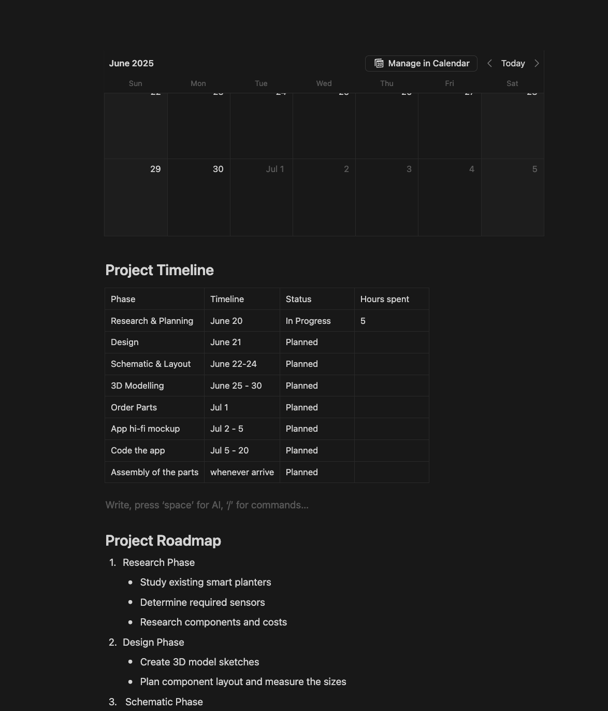

I also made some prototype sketches here.
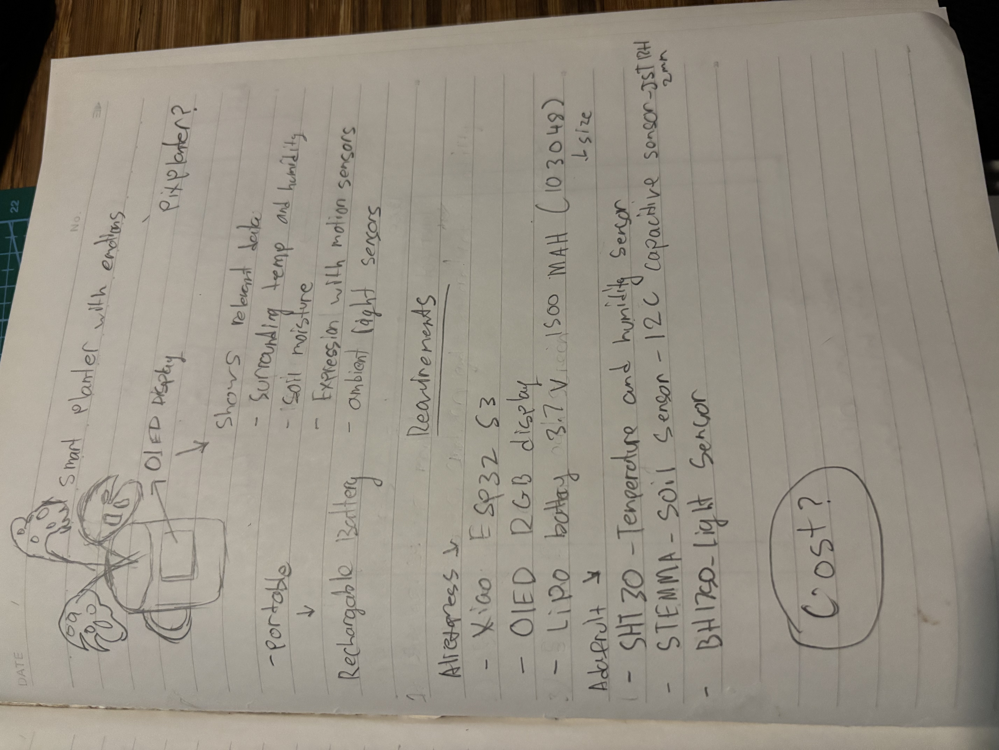
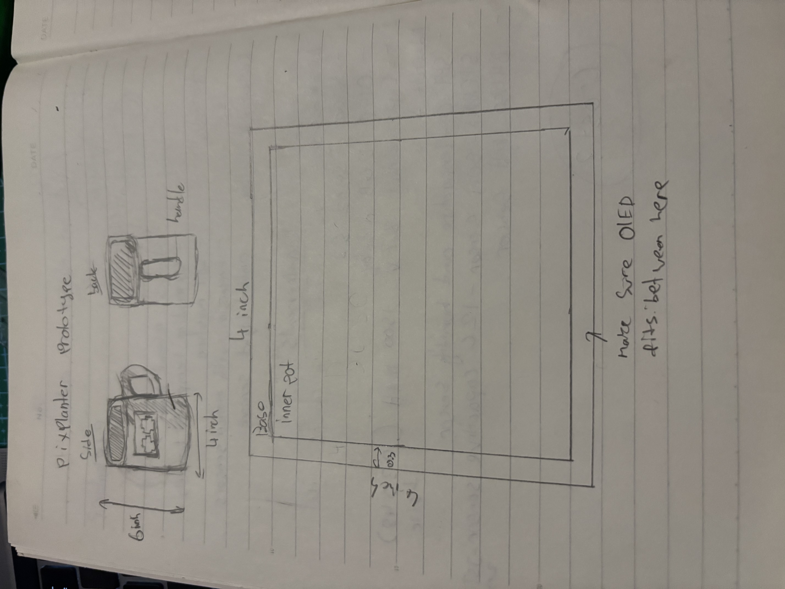
**Total time spent: 5.5h**

# June 21th: Understanding more about the parts + design schematics

I just found out that to charge the battery effectively it will require a battery charger module called TP4056. TP4056 has two different variations with protection IC and without protection. Without protection IC it only protects overcharge, with protection IC it protects overdischarge and over current protection.

I imported the OPL libary for my XIAO ESP32 S3 into KICad and I also added some other pins and batttery module and started wiring for it.. Except I have no clue how to do this....

After some research I found out that the battery can directly connect to XIAO ESP32 from the -BAT and +BAT. I intend to change the ESP32 S3 to C6 since I need an MCU that supports Thread which then allows me to integrate with IOS nicely.

- XIAO ESP32 S3 -> XIAO ESP32 C6 (Thread support )
- LIPO Battery 3.7V 1500mAH 103048 -> LIPO Battery 3.7V 2000mAH (longer battery life)
- SHT30 Temperature And Humidity Sensor -> SHT40 Temperature And Humidity Sensor (apparently better and $2 cheaper)

I have no idea if this is correct or what... 😞
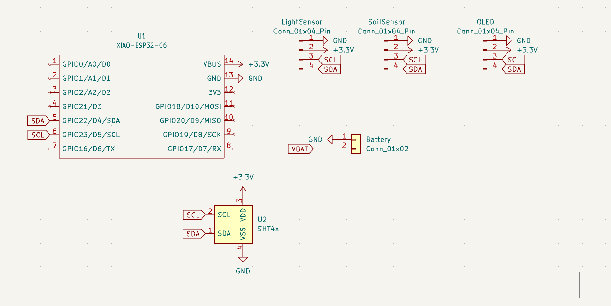

**Total time spent: 3.5h**

# June 22th: Applying footprints

Oh boy... This one was SUPER SUPER confusing for me. I made some changes for the parts to places more "trusted" with well documented parts instead of going to AliExp, the parts like 1.5 inch OLED from waveshare raises the prices abit (hope its okay for Hack Club) because as a beginner who barely have any electronics knowledge I dont understand what schematics symbols to add, what in the world is footprints, and what these parts footprints is. I read the docs aswell as back and fourth chatting with co pilot to assist me making sure that I assigned the correct footprint for each parts.

I hope this is correct ;-;
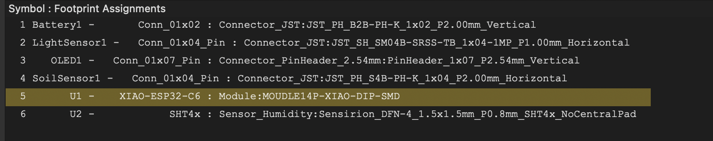

me chatting with copilot for an hour? xD
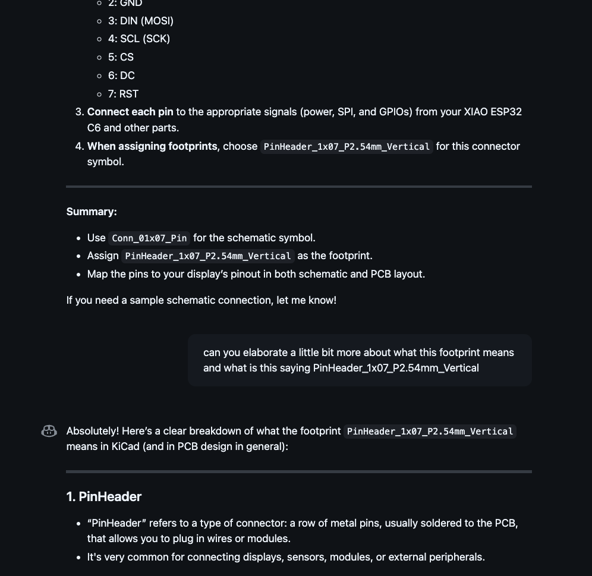
**Total time spent: 2h**

# June 25th: Research Routing the PCB

12AM - 2:16 AM

I finally got into routing the PCB. After going through the documentations for the esp32 I decided to remove the 1x2 connecting pin for the battery because apparently I wont be needing the PH2.0 plug rather just cutting it off and directly solder to the XIAO smd pads! (The MCU schematic does not show 15 and 16 pins for me to connect the wire too so I could'nt figure out how to use the connectors ;-;)

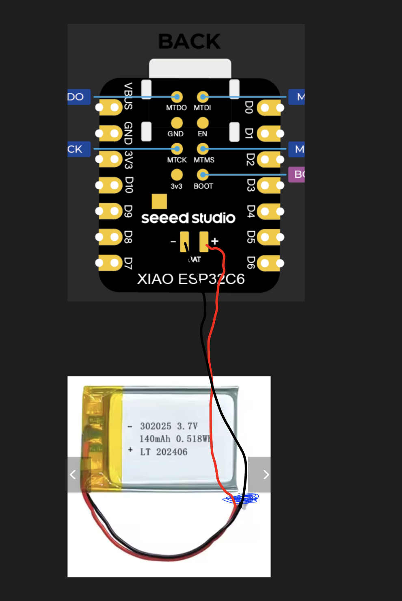

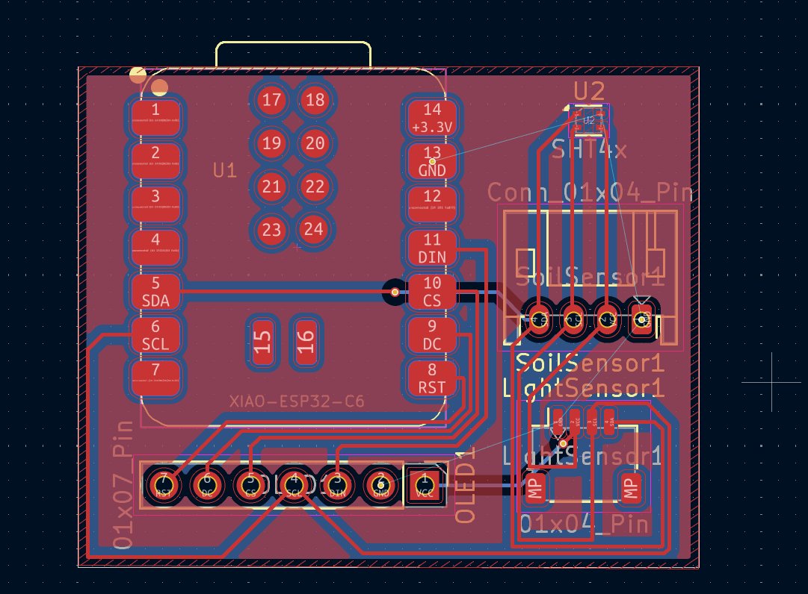

I also used ground fill for the first time :) hope I did it right

**Total time spent: 2h**

# June 27th: I was filming a vlog for day 1:

Youtube [YouTube Short](https://youtube.com/shorts/ty__Sh_dJmw?si=zp3qn9vOzwV2mKUi)
Scripting, Filming, ediitng took a while and I cant remember the time exactly...

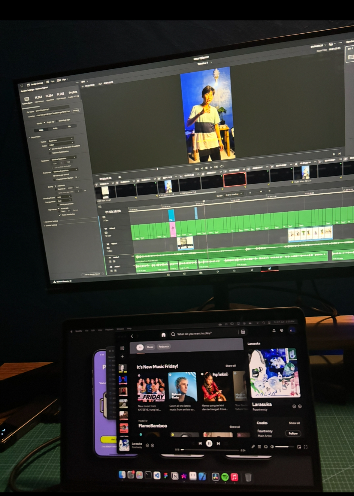

**Total time spent: 5h**

# June 28th: allocating components and 3D sketch

Researching on the ideal size of the pot thickness, the recomendded volume for my Monsterra plant and yeah...

I started sketching the base of the planter, taking account into the water drainage and where the electronic components will go

The outer dimensions for this planter will be 101x101x182mm and the inner case (inner pot where the soil and plant will go) will be 93x93x101. the empty space at the bottom as shown in the sketch will be allocated for the electrical components aswell as a funnel and holes for the water to flow out.

**Total time spent: 3h**

# June 29th: Fusion 3D Modelling

I stated jumping into fusion and start to create the outer and inner case. I also make sure to add a cutout for the OLED to sit in... But then I just realised I need to make the gaps bigger and make the OLED casing more compact and more integrated.

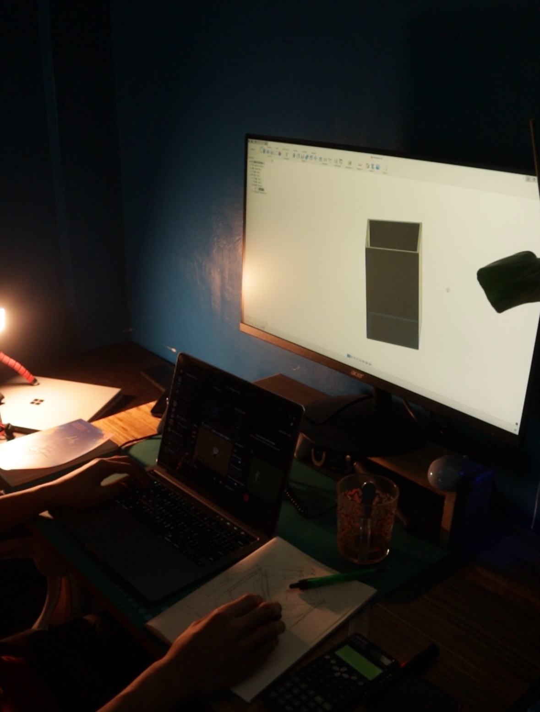

**Total time spent: 4h**

# July 1: Fusion 3D Modelling the enclosure for OLED

This got me burntout...

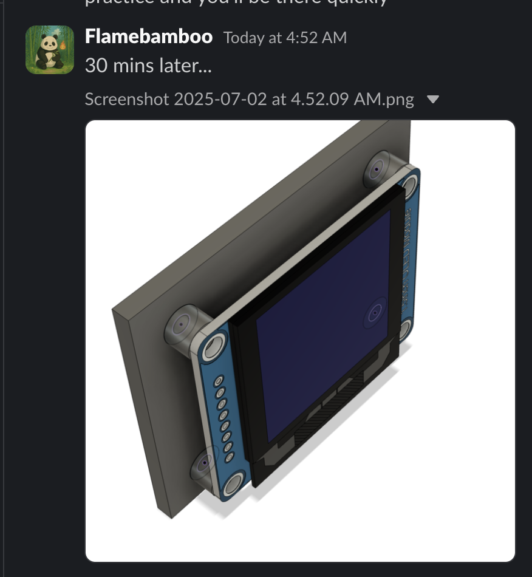
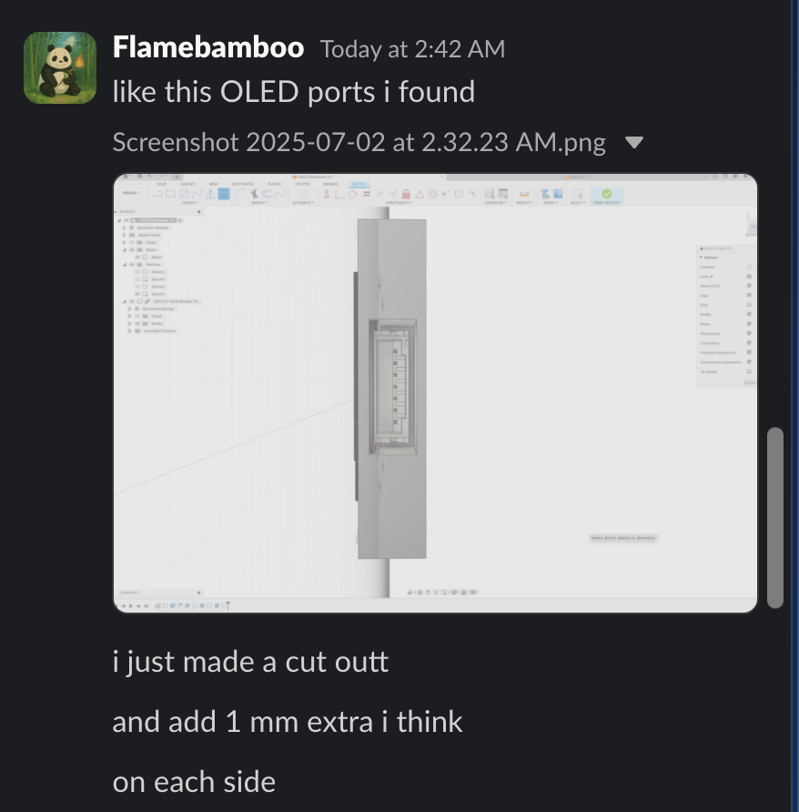

I spent 11pm - 5:30 AM trying to figure out how to use these new tools i've never used before such as project tools, offsets.

Then I had to figure out how to somehow attach the enclosure to the base by joining it (maybe?)...

I kept reiterating and doing the same thing trying to figure it out.

I ended up revamping and start from scratch a ton of times!

still no progress at this point.

**Total time spent: 6h 30m**

# July 2: Released day 2 video

I filmed, edited a content for day 2 which was for the work I did back in June 21st

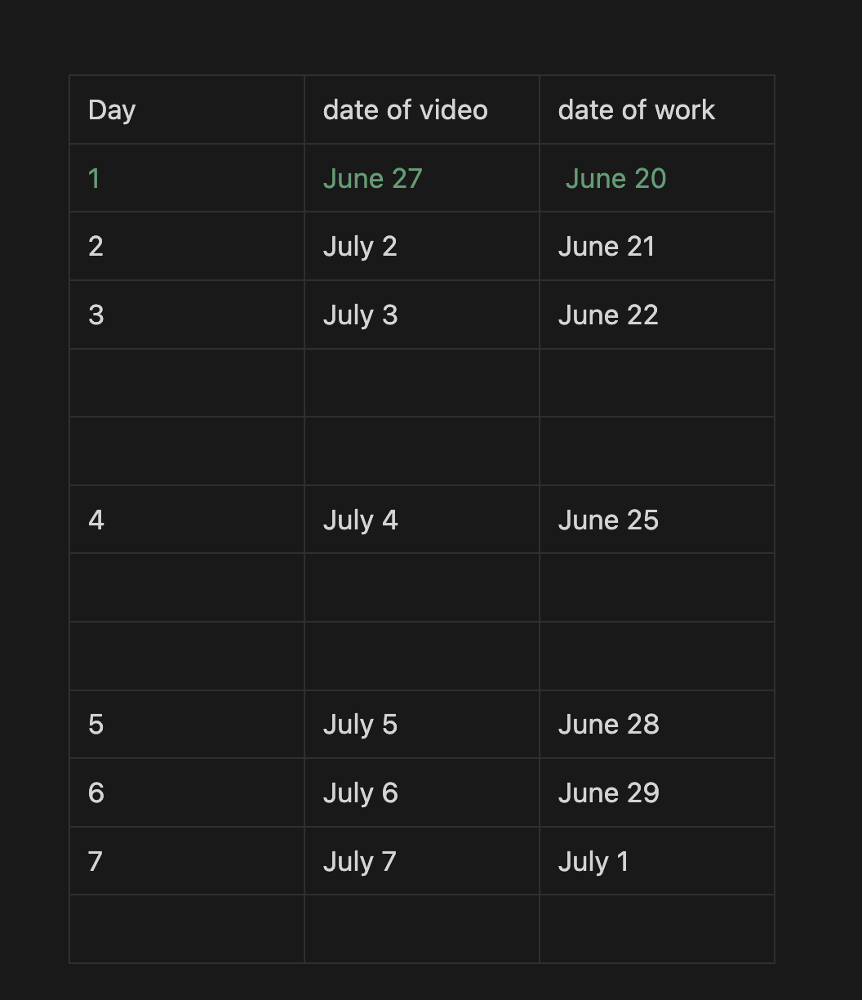

here's the video [youtube](https://youtube.com/shorts/amHQEBcOXe8?si=QgyBYHKR3km967V8), [instagram](https://www.instagram.com/reel/DLnImsxTx7t/)

# July 3: 3d modelling and vlog.

Today's goal is to be consistent and manage my time properly.
Make sure that I can post a video for day 2 and also put in the work for this project.

# July 19:
I have given up for a while because I was burntout from using Fusion, but a burst of motivation finally came back and it is time. I completed the enclosure with snap fit perfectly. The enclosure is seperated with back, middle, front. "Back" is combined with the main base body and "Mid" is combined to "Back" with some chamfer for easy fit. The "Front" Part is standalone with a 0.4mm of fit deviation that can later be attached directly from outside the main base.

#July 20:
Continue working on the inner pot with 5 drainage holes.

